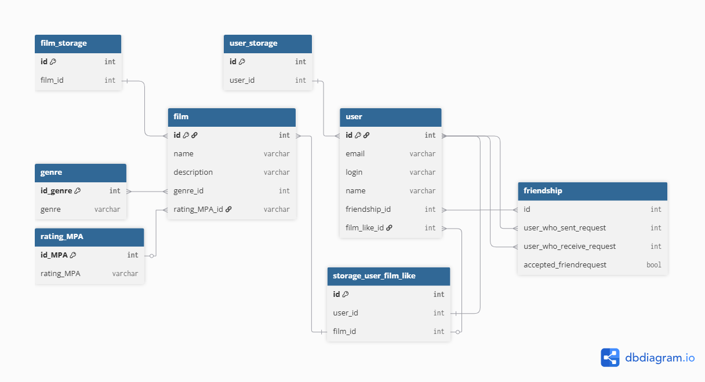

# java-filmorate
Template repository for Filmorate project.

## Блок фильмов
film - центральная таблица каталога. Хранит название (name) и описание (description) фильмов.

gemre - справочник доступных жанров. Таблица film ссылается на неё через внешний ключ genre_id (связь многие ко многим).

reting_MPA - справочник возрастных рейтингов Ассоциации кинокомпаний. Каждому фильму присваивается один рейтинг через внешний ключ rating_MPA_id (связь многие к одному).

film_storage - связующая таблица для управления списками фильмов. Хранит идентификаторы фильмов, ссылаясь на таблицу film.

## Блок пользователей и социальных связей
user - хранит учетные данные пользователей

friendship - таблица для управления социальными связями и заявками в друзья:

  `user_who_sent_request` — ID пользователя, отправившего запрос (ссылается на `user.id`).
  
  `user_who_receive_request` — ID пользователя, получившего запрос (ссылается на `user.id`).
  
  `accepted_friendrequest` (bool) — флаг подтверждения дружбы (true — друзья, false — заявка на рассмотрении).
  
user_storage - хранилище пользователей

## Блок взаиодействия (Лайки)
storage_user_film_like - таблица связи многие ко многим между пользователями и фильмами.

Связывает user_id (кто лайкнул) и film_id (что лайкнули)

На основе данных этой таблица формируется список самых популярных фильмов

-----

#### 1. Получение полной информации о конкретном фильме (с жанром и рейтингом MPA)
```sql
SELECT f.id, f.name, f.description, g.genre, r.rating_MPA 
FROM film f
LEFT JOIN genre g ON f.genre_id = g.id_genre
LEFT JOIN rating_MPA r ON f.rating_MPA_id = r.id_MPA
WHERE f.id = 1;
```

#### 2. Список всех фильмов с сортировкой по алфавиту
```sql
SELECT id, name, description, rating_MPA_id 
FROM film 
ORDER BY name ASC;
```

#### 3. Вывод топ-10 самых популярных фильмов по количеству лайков
```sql
SELECT f.id, f.name, COUNT(l.user_id) AS total_likes
FROM film f
LEFT JOIN storage_user_film_like l ON f.id = l.film_id
GROUP BY f.id, f.name
ORDER BY total_likes DESC
LIMIT 10;
```

#### 4. Получение списка всех пользователей системы
```sql
SELECT id, email, login, name 
FROM user
ORDER BY id;
```

#### 5. Получение профиля конкретного пользователя по его ID
```sql
SELECT id, email, login, name, friendship 
FROM user
WHERE id = 42;
```

#### 6. Список фильмов, которые лайкнул конкретный пользователь
```sql
SELECT f.id, f.name 
FROM film f
JOIN storage_user_film_like l ON f.id = l.film_id
WHERE l.user_id = 42;
```

#### 7. Список всех пользователей, поставивших лайк конкретному фильму
```sql
SELECT u.id, u.login, u.name 
FROM user u
JOIN storage_user_film_like l ON u.id = l.user_id
WHERE l.film_id = 1;
```

#### 8. Фильтрация фильмов по конкретному жанру (например, поиск по названию жанра)
```sql
SELECT f.id, f.name, g.genre 
FROM film f
JOIN genre g ON f.genre_id = g.id_genre
WHERE g.genre = 'Комедия';
```

#### 9. Вывод фильмов, у которых установлен определенный возрастной рейтинг (например, MPA_id = 3)
```sql
SELECT f.id, f.name, r.rating_MPA 
FROM film f
JOIN rating_MPA r ON f.rating_MPA_id = r.id_MPA
WHERE r.id_MPA = 3;
```
