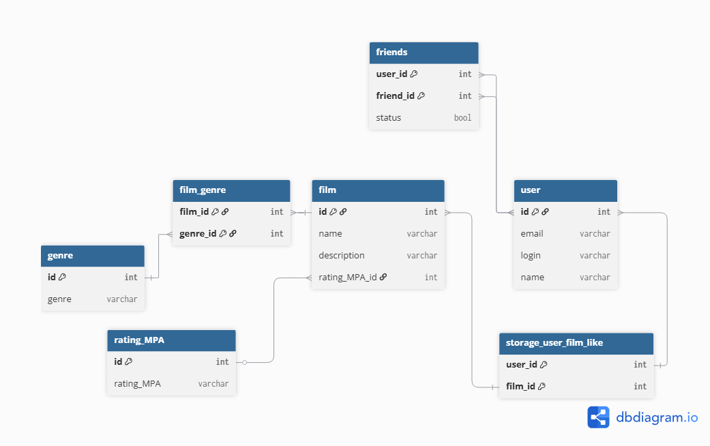

# java-filmorate
Template repository for Filmorate project.

## Блок фильмов
film - центральная таблица каталога. Хранит название (name) и описание (description) фильмов.

genre - справочник доступных жанров. Таблица film ссылается на неё через внешний ключ genre_id (связь многие ко многим).

reting_MPA - справочник возрастных рейтингов Ассоциации кинокомпаний. Каждому фильму присваивается один рейтинг через внешний ключ rating_MPA_id (связь многие к одному).

## Блок пользователей и социальных связей
user - хранит учетные данные пользователей

friends - таблица для управления социальными связями и заявками в друзья:

  user_id — ID пользователя, отправившего запрос (ссылается на user.id).
  
  freind_id — ID пользователя, получившего запрос (ссылается на user.id).
  
  status — флаг подтверждения дружбы (true — друзья, false — заявка на рассмотрении).
  

## Блок взаиодействия (Лайки)
storage_user_film_like - таблица связи многие ко многим между пользователями и фильмами.

Связывает user_id (кто лайкнул) и film_id (что лайкнули).

На основе данных этой таблица формируется список самых популярных фильмов.

-----

#### 1. Список пользователей, лайкнувших конкретный фильм
```sql
SELECT u.id, 
       u.login, 
       u.name
FROM user u
JOIN storage_user_film_like l ON u.id = l.user_id
WHERE l.film_id = 5;
```

#### 2. Топ-10 самых популярных фильмов по лайкам
```sql
SELECT f.id, 
       f.name, 
       COUNT(l.user_id) AS likes_count
FROM film f
LEFT JOIN storage_user_film_like l ON f.id = l.film_id
GROUP BY f.id, f.name
ORDER BY likes_count DESC
LIMIT 10;
```

#### 3. Список друзей конкретного пользователя со статусом подтверждения
```sql
SELECT u.id, 
       u.name, 
       f.status
FROM friends f
JOIN user u ON f.friend_id = u.id
WHERE f.user_id = 1 AND f.status = true;
```

#### 4. Вывод фильмов с их жанрами и возрастным рейтингом MPA
```sql
SELECT f.name AS film_name, 
       g.genre, 
       r.rating_MPA
FROM film f
JOIN film_genre fg ON f.id = fg.film_id
JOIN genre g ON fg.genre_id = g.id_genre
JOIN rating_MPA r ON f.rating_MPA_id = r.id_MPA;

```

#### 5. Поиск пользователей, которые вообще не поставили ни одного лайка
```sql
SELECT u.id, 
       u.email, 
       u.login
FROM user u
LEFT JOIN storage_user_film_like l ON u.id = l.user_id
WHERE l.user_id IS NULL;
```